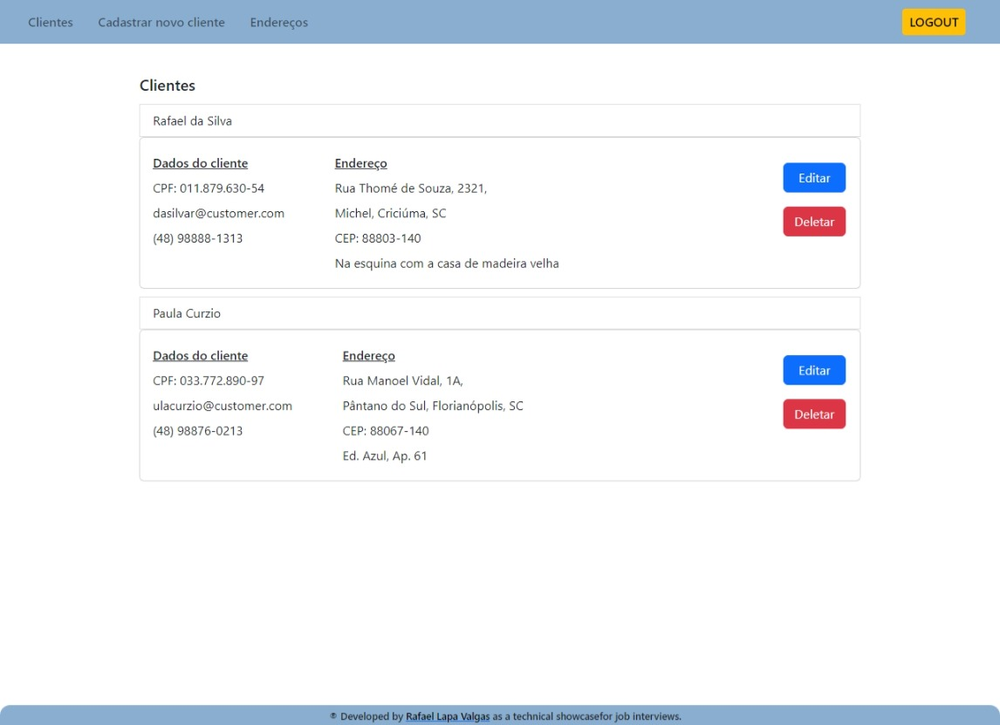

<!-- LANGUAGE -->
<!-- LANGUAGE -->
<!-- LANGUAGE -->

english -
[portuguese](README_pt-br.md)
<br>

<!-- HEADER -->
<!-- HEADER -->
<!-- HEADER -->
<h1 align="center">Customer Registration System with ZIP Code Validator</h1>
<p align="center">This was a technical challenge for a job interview.</p>
<br>

<p align="center">
    
</p>

<!-- DATE -->
<!-- DATE -->
<!-- DATE -->
<p align="center">
        <span>Aug 4th</span>,
        <span>2022</span> ~ 
        <span>Aug 9th</span>,
        <span>2022</span></p>
<br>

<!-- LOCAL -->
<!-- LOCAL -->
<!-- LOCAL -->
<p align="center">
        <span>Technical Challenge</span> -
        <span>Java Full Stack Developer</span></p>
<!-- <p align="center">
        <span></span> -
        <span></span></p> -->
<!-- <p align="center">
        <span></span> -
        <span></span></p> -->
<!-- <p align="center">
        <span></span> -
        <span></span></p> -->
<!-- <p align="center">
        <span></span> -
        <span></span></p> -->
<br>

<!-- TEXT -->
<!-- TEXT -->
<!-- TEXT -->
<!-- goals -->
<!--  just objectives, no results or opinions.-->
<p align="left">In this technical challenge, the development of a customer registration application was proposed, which would consume the Correios API to validate address data using the ZIP code. The fundamental requirement was the implementation of a frontend with Vue.js and a backend with Java, using containerized infrastructure with Docker.</p>
<!-- results -->
<!-- just results, no objectives or opinions -->
<p align="left">The backend was developed using the Spring Boot framework in Java. For data storage, a relational database H2 was utilized. API communication was implemented with GraphQL, providing routes for customer and address registration and retrieval. Additionally, the option to develop unit test coverage for the backend was implemented to ensure greater reliability of the system. The backend was made available as a Docker image and Docker compose, allowing for easy configuration and execution of the environment.</p>
<!-- results -->
<!-- just results, no objectives or opinions -->
<p align="left">The frontend was developed using Vue.js with Vuex / Pinia, ensuring a smooth and interactive user experience. The login, registration, candidate listing, and detailed viewing screens were designed for intuitive navigation. The system of sub-routes was adopted for better application organization. The choice to develop test coverage for the frontend provided increased security and reliability to the system. The frontend was also made available as a Docker image and Docker compose, simplifying the deployment and execution of the application.</p>
<!-- conclusion -->
<!-- just opinions, no objectives or results -->
<p align="left">In conclusion, the technical challenge of development as a Java Full Stack Developer provided the opportunity to create a customer registration application with integration to the Correios API for address validation. The project involved the use of modern technologies such as Vue.js and Spring Boot and was implemented with attention to usability and reliability details. The ability to make the application available in Docker environments facilitated the configuration and execution of the system. The learning acquired during this challenge reinforced the importance of seeking innovative and functional solutions, aligning with best practices in full-stack development. I believe that this experience can inspire other developers to continue exploring new opportunities to enhance the field of information technology and promote significant advancements in increasingly integrated and efficient solutions.</p>
<!-- conclusion -->
<!-- just opinions, no objectives or results -->
<p align="left">Prerequisites:</p>

- **Features**:
- [x] Authentication by login and password
- [x] List clients, register clients, delete clients, and view details
- [x] Validation of the client's address through [OpenCEP](https://opencep.com/)

- **Backend**:
- [x] Develop the backend in [Spring Boot](https://spring.io/projects/spring-boot) / Java
- [x] Utilize a relational database (I used [H2](https://www.h2database.com/html/main.html))
- [x] Use [Graphql](https://graphql.org/) for API communication
- [x] Provide API routes for customer and address registration and retrieval
- [x] Develop unit test coverage for the backend (optional)
- [x] Make the backend available as a Docker image and Docker compose

- **Frontend**:
- [x] Develop the frontend in [VueJs](https://vuejs.org/) with [Vuex](https://vuex.vuejs.org/) / [Pinia](https://pinia.vuejs.org/)
- [x] Create login, registration, customer listing, and viewing screens
- [x] Implement the sub-routes system
- [x] Develop test coverage for the frontend (optional)
- [x] Make the frontend available as a Docker image and Docker compose
      <br>

<!-- DOWNLOADS -->
<!-- DOWNLOADS -->
<!-- DOWNLOADS -->
<!-- <div style="display: flex; justify-content: left; margin-right: 40px;">
</div>
<br> -->
<br>

<!-- GUIDES -->
<!-- GUIDES -->
<!-- GUIDES -->

# Getting Started

## Prerequisites

- [x] <a href="https://www.docker.com/">Docker</a>

## Installation

1. Run Docker
2. Run and wait the containers up:

```
code/src/docker-compose up
```

3. Go to the link: <a href="http://localhost:4173/">http://localhost:4173/</a>

4. App login:

   1. **user**: admin
   2. **password**: admin

5. The frontend end-to-end (e2e) tests were developed with [Cypress](https://docs.cypress.io/).
   1. It is possible to run the tests to see the application in action.
   2. In the root directory of the frontend, run the following command:

```shell
$ npx cypress run
```

6. The backend runs on the link [http://localhost:8080/](http://localhost:8080/)

   1. You can run queries on the backend of the application at [http://localhost:8080/graphiql?path=/graphql](http://localhost:8080/graphiql?path=/graphql)
   2. In the [resources directory of the backend](https://github.com/lapavalgas/technical_showcase_zip_code/tree/main/backend/src/main/resources/graphql), you can find the queries used for this application.

7. The backend unit tests were developed with [jUnit](https://junit.org/junit5/)/[Spring](https://spring.io/projects/spring-boot).

   2. In the root directory of the backend, run the following command:

```shell
$ mvn test
```

<!-- TECH -->
<!-- TECH -->
<!-- TECH -->

## Tech stask

<!-- FRONT STACK -->
<div style="display: flex; justify-content: left;">    
        
        
        
        
        
        
        
        
        
</div>
<br>

<!-- IMAGES -->
<!-- IMAGES -->
<!-- IMAGES -->

## Illustrative images

<!-- ### Image title -->
<div>
        
</div>
<div>
        
</div>
<div>
        
</div>
<div>
        
</div>
<div>
        
</div>
<div>
        
</div>
