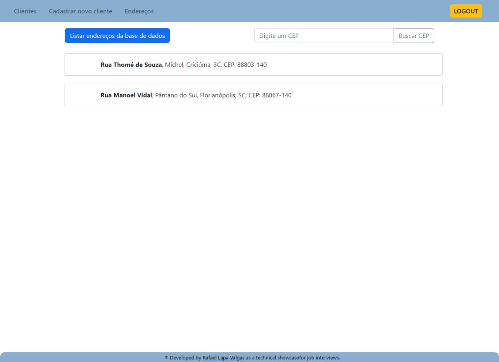
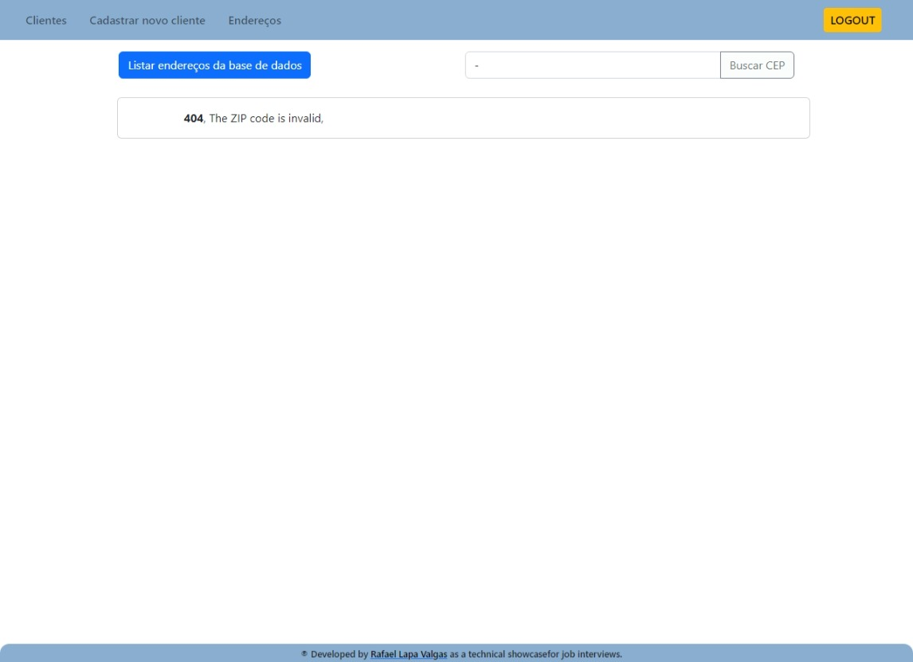

<!-- LANGUAGE -->
<!-- LANGUAGE -->
<!-- LANGUAGE -->

[english](README.md) -
portuguese
<br>

<!-- HEADER -->
<!-- HEADER -->
<!-- HEADER -->
<h1 align="center">Sistema de cadastro de Clientes com validador de CEP</h1>
<p align="center">Esse foi um desafio técnico para uma entrevista de emprego.</p>
<br>

<p align="center">
    
</p>

<!-- DATE -->
<!-- DATE -->
<!-- DATE -->
<p align="center">
        <span>4 de Ago</span>,
        <span>2022</span> ~ 
        <span>9 de Ago</span>,
        <span>2022</span></p>
<br>

<!-- LOCAL -->
<!-- LOCAL -->
<!-- LOCAL -->
<p align="center">
        <span>Desafio técnico</span> -
        <span>Java Full Stack Developer</span></p>
<!-- <p align="center">
        <span></span> -
        <span></span></p> -->
<!-- <p align="center">
        <span></span> -
        <span></span></p> -->
<!-- <p align="center">
        <span></span> -
        <span></span></p> -->
<!-- <p align="center">
        <span></span> -
        <span></span></p> -->
<br>

<!-- TEXT -->
<!-- TEXT -->
<!-- TEXT -->
<!-- goals -->
<!--  just objectives, no results or opinions.-->
<p align="left">
Neste desafio técnico, propôs-se o desenvolvimento de uma aplicação de cadastro de clientes, que consumisse a API dos Correios para validar os dados de endereço por meio do CEP. O requisito fundamental era a implementação de um frontend com Vue.js e um backend com Java, utilizando infraestrutura dockerizada.</p>
<!-- results -->
<!-- just results, no objectives or opinions -->
<p align="left">O backend foi desenvolvido utilizando o framework Spring Boot em Java. Para o armazenamento dos dados, foi utilizado um banco de dados relacional H2. A comunicação das APIs foi implementada com Graphql, disponibilizando rotas para cadastro e consumo de clientes e endereços. Além disso, foi realizada a opção de desenvolver cobertura de testes unitários para o backend, proporcionando maior confiabilidade ao sistema. A disponibilização do backend em imagem Docker e docker compose permitiu a fácil configuração e execução do ambiente.</p>
<!-- results -->
<!-- just results, no objectives or opinions -->
<p align="left">
O frontend foi desenvolvido em Vue.js com Vuex / Pinia, garantindo uma experiência de usuário fluida e interativa. As telas de login, cadastro, listagem de candidatos e visualização detalhada foram projetadas para uma navegação intuitiva. O sistema de subrotas foi adotado para uma melhor organização da aplicação. A opção de desenvolver cobertura de testes para o frontend ofereceu maior segurança e confiabilidade no sistema. O frontend também foi disponibilizado em imagem Docker e docker compose, simplificando a implantação e execução do aplicativo.</p>
<!-- conclusion -->
<!-- just opinions, no objectives or results -->
<p align="left">
Em conclusão, o desafio técnico de desenvolvimento como Java Full Stack Developer proporcionou a oportunidade de criar uma aplicação de cadastro de clientes com integração à API dos Correios para validação de endereços. O projeto abrangeu a utilização de tecnologias modernas, como Vue.js e Spring Boot, e foi implementado com atenção aos detalhes de usabilidade e confiabilidade. A possibilidade de disponibilizar a aplicação em ambientes Docker facilitou a configuração e execução do sistema. O aprendizado adquirido durante esse desafio reforçou a importância de buscar soluções inovadoras e funcionais, alinhando-se às melhores práticas do desenvolvimento full stack. Assim, acredito que essa experiência possa inspirar outros desenvolvedores a continuarem explorando novas oportunidades para aprimorar a área de tecnologia de informação e promover avanços significativos em soluções cada vez mais integradas e eficientes.</p>
<!-- conclusion -->
<!-- just opinions, no objectives or results -->
<p align="left">Pré-requisitos:</p>

- **Features**:
- [x] Autenticação por login e senha
- [x] Listar clientes, cadastrar clientes, excluir clientes e visualizar detalhes
- [x] Validação do endereço do cliente pelo [OpenCEP](https://opencep.com/)

- **Backend**:
- [x] Desenvolver o backend em [Spring Boot](https://spring.io/projects/spring-boot) / Java
- [x] Utilizar um banco de dados relacional (utilizei o [H2](https://www.h2database.com/html/main.html))
- [x] Utilizar [Graphql](https://graphql.org/) para o sistema de comunicação das APIs
- [x] Disponibilizar na API rotas para cadastro e consumo de clientes e endereços
- [x] Desenvolver cobertura de testes unitários para o backend (opcional)
- [x] Disponibilizar o backend em imagem Docker e docker compose

- **Frontend**:
- [x] Desenvolver o frontend em [VueJs](https://vuejs.org/) com [Vuex](https://vuex.vuejs.org/) / [Pinia](https://pinia.vuejs.org/)
- [x] Desenvolver tela de login, cadastro, listagem de clientes e visualização
- [x] Utilizar o sistema de subrotas
- [x] Desenvolver cobertura de testes para o frontend (opcional)
- [x] Disponibilizar o frontend em imagem Docker e docker compose

<br>

<!-- DOWNLOADS -->
<!-- DOWNLOADS -->
<!-- DOWNLOADS -->
<!-- <div style="display: flex; justify-content: left; margin-right: 40px;">
</div>
<br> -->
<br>

<!-- GUIDES -->
<!-- GUIDES -->
<!-- GUIDES -->

# Getting Started

## Prerequisites

- [x] <a href="https://www.docker.com/">Docker</a>

## Installation

1. Run Docker
2. Run and wait the containers up:

```
code/src/docker-compose up
```

3. Go to the link: <a href="http://localhost:4173/">http://localhost:4173/</a>

4. App login:

   1. **user**: admin
   2. **password**: admin

5. Os testes e2e do frontend foram desenvolvidos com [Cypress](https://docs.cypress.io/)
   1. É possível executar os testes para ver a aplicação funcionando
   2. Na raiz do diretório de frontend, rodar o comando:

```shell
$ npx cypress run
```

6. O backend roda no link [http://localhost:8080/](http://localhost:8080/)

   1. no link [http://localhost:8080/graphiql?path=/graphql](http://localhost:8080/graphiql?path=/graphql) é possível rodar querys no backend da aplicação
   2. no diretório [resources do backend](https://github.com/lapavalgas/technical_showcase_zip_code/tree/main/backend/src/main/resources/graphql) é possível ver as querys utilizadas para essa aplicação

7. Os testes unitários do backend foram desenvolvidos com [jUnit](https://junit.org/junit5/)/[Spring](https://spring.io/projects/spring-boot)

   2. Na raiz do diretório de backend, rodar o comando:

```shell
$ mvn test
```

<!-- TECH -->
<!-- TECH -->
<!-- TECH -->

## Tech stask

<!-- FRONT STACK -->
<div style="display: flex; justify-content: left;">    
        
        
        
        
        
        
        
        
        
</div>
<br>

<!-- IMAGES -->
<!-- IMAGES -->
<!-- IMAGES -->

## Illustrative images

<!-- ### Image title -->
<div>
        
</div>
<div>
        
</div>
<div>
        
</div>
<div>
        
</div>
<div>
        
</div>
<div>
        
</div>
